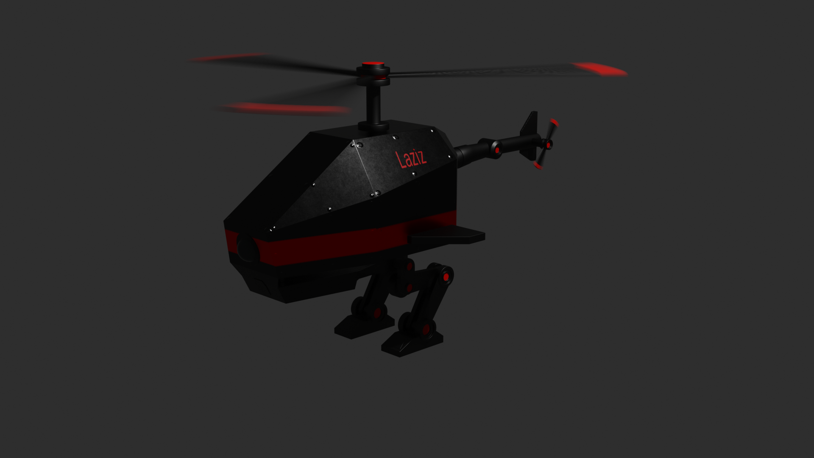

# UNO-Twin: 3D Sensing Aura for EMI-Sensitive Robotics

Invisible electromagnetic hazards may cause robot sensors to drift and their navigation to fail.

This repo contains the source code for **UNO-Twin** app, a real-time digital twin that detects electromagnetic interference (EMI) and visualises it as a 3D "sensing aura". Using an *Arduino UNO Q* and a *Bosch BNO055* 9-axis sensor, this app mirrors the robot's live orientation and flags potential EMI risks.

> [!TIP]
> This project was built for the [Invent the Future with Arduino UNO Q and App Lab](https://www.hackster.io/contests/invent-the-future-with-arduino-uno-q-and-app-lab) contest. Qualcomm Arduino Uno Q board (with 4G RAM) was kindly provided by the Arduino, Qualcomm and Hackster teams, thank you!

## 📑 Table of Contents

- [Hardware Setup](#hardware-setup)
- [Detection Layer: Hard-Iron Calibration](#detection-layer-hard-iron-calibration)
- [Detection Layer: Anomaly Scoring](#detection-layer-anomaly-scoring)
- [Visualisation Layer: The 3D Twin](#visualisation-layer-the-3d-twin)
- [Demos & Results](#demos--results)

## Hardware Setup


| Component               | Purpose        | Notes                                      |
| ----------------------- | -------------- | ------------------------------------------ |
| Arduino UNO Q           | Compute        | Dragonwing MPU + STM32U585 MCU             |
| Bosch BNO055 breakout   | 9-axis sensing | Adafruit STEMMA QT #4646 or SparkFun Qwiic |
| Qwiic / STEMMA QT cable | Power + I²C    | JST-SH 4-pin, keyed                        |

The Qwiic connector is typically wired to **`Wire1`**. The sketch probes both `Wire1` and `Wire` at addresses `0x28` and `0x29`, so either breakout variant is found automatically.

> [!IMPORTANT]
> The BNO055 runs in **AMG (raw) mode** on purpose. Its on-chip fusion modes power the magnetometer down, as this project utilises the raw magnetic flux.

## Detection Layer: Hard-Iron Calibration

The UNO Q is located next to the sensor and that's why contributes with its own magnetic field. That body-fixed offset can make the heading rotation-dependent.

A sphere fit over samples collected while rotating the board recovers the offset, which is then subtracted from every reading and persisted to `hard_iron.json`.

```python
# From main.py: the fit only runs once every axis has swept enough of the sphere
if len(_cal_pts) < CAL_POINTS // 3:
    return
if not all(_cal_hi[i] - _cal_lo[i] >= CAL_SPAN for i in range(3)):
    return

centre = _sphere_fit(_cal_pts)
```

Measured on the provided Arduino UNO Q hardware, the residual body-fixed offset was **2.35 µT** against a 49.16 µT local field.

## Detection Layer: Anomaly Scoring

Two independent signals are scored with a rolling z-score against a 30-second baseline, so the detector adapts to whatever "normal" is in that building:

- **`|B|`** — total field strength, rotation-invariant once hard-iron corrected.
- **Ghost delta** — divergence between inertial yaw and magnetic heading.

```python
# From main.py: the field term is one-sided on purpose
score = max(max(z_B, 0.0), abs(z_d))
```

> [!NOTE]
> Interference *adds* magnetic energy, so a hazard can only push `|B|` up. Scoring a *drop* as an anomaly meant simply lifting the board off the desk flared the aura red. Replayed over a 1702-frame capture, the one-sided term removed all 129 false alerts and cut the peak score from 44.34 to 5.21.

Two further safeguards were put in place:

| Mechanism            | Problem solved                                                                                                                   |
| -------------------- | -------------------------------------------------------------------------------------------------------------------------------- |
| Baseline gate (2.5σ) | A source present but below alert level would otherwise be *learned as normal*, inflating sigma and suppressing its own detection |
| Alert freeze (7σ)    | A stationary hazard would otherwise fade from the baseline within one window and clear its own alert                             |

## Visualisation Layer: The 3D Twin

The dashboard is a single self-contained HTML file served by the `web_ui` brick in Arduino App Lab, using three.js visualisation for 3D twin, the aura and the EMI radar.

```javascript
// Model forward is +Z; the dashboard reference is +X, a quarter turn away.
// Yaw is applied first in YXZ order, so the offset is a world-space spin
// that leaves pitch and roll untouched.
const MODEL_YAW_OFFSET = Math.PI/2;
robot.rotation.order = "YXZ";
robot.rotation.y = -sm.yaw*D + MODEL_YAW_OFFSET;
```

The aura shifts from blue through amber to red as the score increases, and the radar sweep marks a detected source at its bearing — holding it until the next scan completes.



> [!TIP]
> 3D model of robotic helicopter was built in Blender v5.2, by following a Blender tutorial of Ryan King, thank you!

## Demos & Results

- Project submission: [Hackster_project](https://www.hackster.io/user87111/uno-twin-3d-sensing-aura-for-emi-sensitive-robotics-5954ab)
- Video demonstration: [YouTube video](https://youtu.be/FNM0b1PCSt0)
