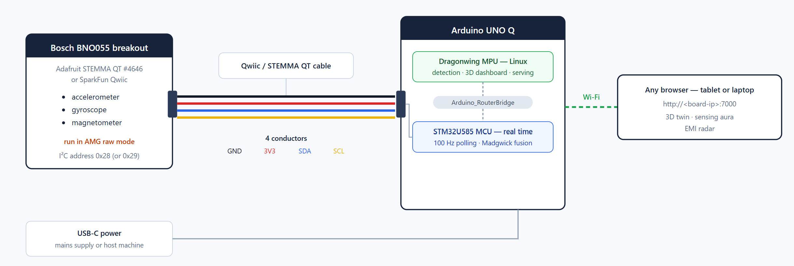

# UNO-Twin: 3D Sensing Aura for EMI-Sensitive Robotics

Invisible electromagnetic hazards may cause robot sensors to drift and their navigation to fail. This repo contains the source code for **UNO-Twin** app, a real-time digital twin that detects electromagnetic interference (EMI) and visualise it as a 3D "sensing aura". Using an *Arduino UNO Q* and a *Bosch BNO055* 9-axis sensor, this solution mirrors the robot's live orientation and flags EMI risks.

> [!TIP]
> This project was built for the [Invent the Future with Arduino UNO Q and App Lab](https://www.hackster.io/contests/invent-the-future-with-arduino-uno-q-and-app-lab) hackathon. Qualcomm Arduino Uno Q board (with 4G RAM) was kindly provided by the Arduino and Hackster teams, thank you!

## 📑 Table of Contents

- [Hardware Setup](#hardware-setup)
- [Dual-Brain Architecture](#dual-brain-architecture)
- [Detection Layer: Hard-Iron Calibration](#detection-layer-hard-iron-calibration)
- [Detection Layer: Anomaly Scoring](#detection-layer-anomaly-scoring)
- [Visualisation Layer: The 3D Twin](#visualisation-layer-the-3d-twin)
- [Deploying Without Installing Anything](#deploying-without-installing-anything)
- [Repository Layout](#repository-layout)
- [Demos & Results](#demos--results)

## Hardware Setup

| Component               | Purpose        | Notes                                      |
| ----------------------- | -------------- | ------------------------------------------ |
| Arduino UNO Q           | Compute        | Dragonwing MPU + STM32U585 MCU             |
| Bosch BNO055 breakout   | 9-axis sensing | Adafruit STEMMA QT #4646 or SparkFun Qwiic |
| Qwiic / STEMMA QT cable | Power + I²C    | JST-SH 4-pin, keyed                        |

The Qwiic connector is typically wired to **`Wire1`**. The sketch probes both `Wire1` and `Wire` at addresses `0x28` and `0x29`, so either breakout variant is found automatically.

> [!IMPORTANT]
> The BNO055 runs in **AMG (raw) mode** on purpose. Its on-chip fusion modes power the magnetometer down, as this project utilises the raw magnetic flux.

